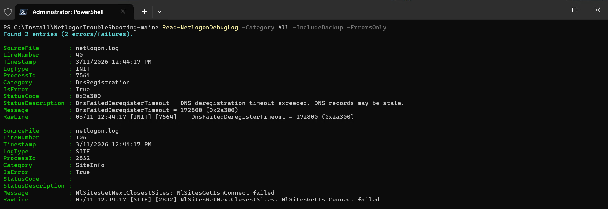
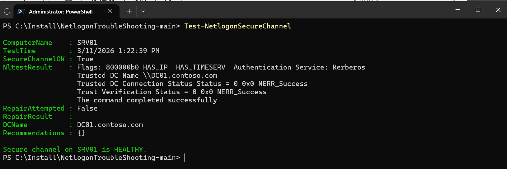
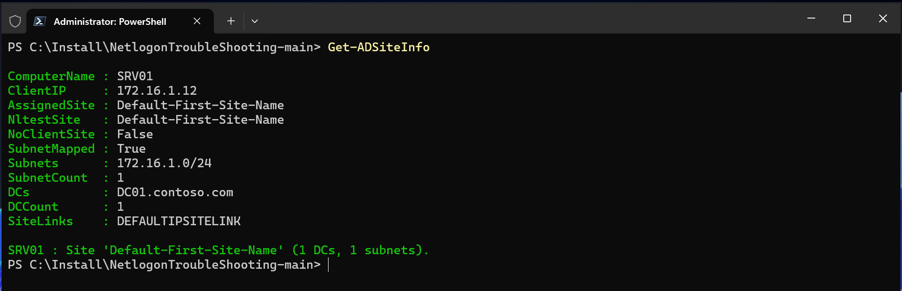
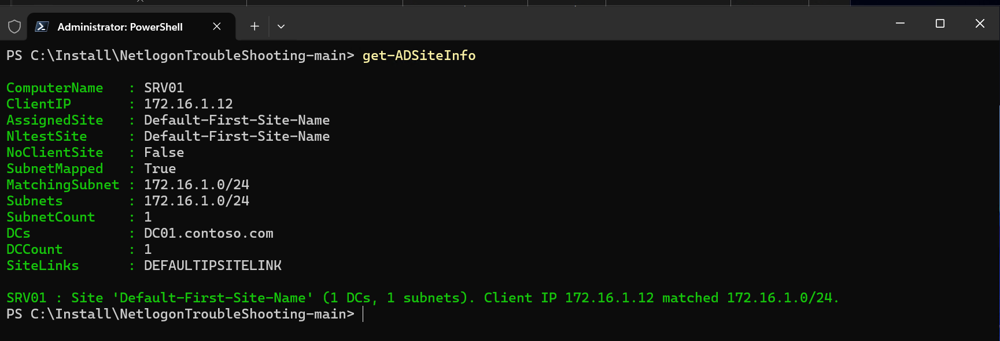

# NetlogonTroubleShooting


A PowerShell module for diagnosing and troubleshooting **Netlogon** issues in Active Directory environments. It parses event logs (e.g. 5719, 5805), manages Netlogon debug logging, and tests secure channel health — all with human-readable output and actionable remediation guidance.

---

## Features

- **Event Log Parsing** — Query and enrich Netlogon-related events (5719, 5783, 5805, 5722, 5723, 5721, 5781, 3210) with plain-English descriptions and recommended actions.
- **Debug Log Management** — Enable/disable Netlogon debug logging via registry with configurable verbosity levels.
- **Debug Log Reader** — Parse `netlogon.log` into structured objects, filter by category (Authentication, DC Discovery, DNS, Secure Channel), and surface errors.
- **Secure Channel Testing** — Test and repair the Netlogon secure channel with detailed diagnostic output.
- **DC Port Connectivity** — Test all required AD/Netlogon ports (53, 88, 135, 389, 445, 464, 636, 3268, 3269) against discovered DCs.
- **DNS Record Validation** — Verify critical SRV and A records (`_ldap._tcp.dc._msdcs`, `_kerberos._tcp`, `_gc._tcp`, site-specific) are resolvable.
- **Time Synchronization** — Check time skew between a computer and its authenticating DC (Kerberos 5-minute tolerance).
- **DC Locator Diagnostics** — Parsed `nltest /dsgetdc` output with flags for force rediscovery, site, PDC, KDC, time server, and writable DC.
- **AD Site Information** — Show site assignment, subnet mapping, and DCs in the site. Detect `NO_CLIENT_SITE` conditions.
- **Comprehensive Diagnostic Report** — One-shot `Invoke-NetlogonDiagnostic` combining all checks into a text or HTML report.
- **Remote Support** — All commands accept `-ComputerName` for remote execution via PowerShell Remoting (WinRM).
- **WinRM Pre-flight Check** — `Invoke-NetlogonDiagnostic` validates WinRM connectivity before running remote checks and provides a step-by-step troubleshooting checklist (WinRM service, firewall rules TCP 5985/5986, `Enable-PSRemoting`, TrustedHosts) when the connection fails.

---

## Requirements

| Requirement | Minimum |
|---|---|
| PowerShell | 5.1 |
| OS | Windows (domain-joined or hybrid for full functionality) |
| Privileges | Administrator (for Enable/Disable debug logging) |
| Pester | 5.x (for running tests) |

---

## Installation

```powershell
# Clone or copy to a module path
Copy-Item -Path .\NetlogonTroubleShooting -Destination "$env:USERPROFILE\Documents\PowerShell\Modules\" -Recurse

# Import the module
Import-Module NetlogonTroubleShooting
```

---

## Functions

| Function | Description |
|---|---|
| `Get-NetlogonEvent` | Retrieves and enriches Netlogon events from the System event log |
| `Enable-NetlogonDebug` | Enables Netlogon debug logging (sets DBFlag in registry) |
| `Disable-NetlogonDebug` | Disables Netlogon debug logging |
| `Get-NetlogonDebugStatus` | Checks the current debug logging configuration and log file status |
| `Read-NetlogonDebugLog` | Parses netlogon.log into structured, filterable objects |
| `Get-NetlogonStatus` | Gets comprehensive Netlogon service and secure channel status |
| `Test-NetlogonSecureChannel` | Tests and optionally repairs the secure channel |
| `Test-DCPortConnectivity` | Tests all required AD/Netlogon TCP ports against DCs |
| `Test-NetlogonDnsRecords` | Validates critical AD DNS SRV and A records |
| `Test-TimeSynchronization` | Checks time skew between a computer and its authenticating DC |
| `Get-DCLocatorInfo` | Parsed DC locator output with force rediscovery, site, PDC, KDC flags |
| `Get-ADSiteInfo` | Shows AD site assignment, subnets, and DCs in the site |
| `Invoke-NetlogonDiagnostic` | Runs all checks and produces a consolidated text or HTML report |

---

## Usage & Sample Output

### Get-NetlogonEvent

Retrieves Netlogon-related events from the Windows event log with human-readable summaries and remediation steps.

```powershell
# All Netlogon events from the last 24 hours
Get-NetlogonEvent

# Only Event ID 5719, last 7 days
Get-NetlogonEvent -EventId 5719 -StartTime (Get-Date).AddDays(-7)

# Remote query
Get-NetlogonEvent -ComputerName 'DC01' -MaxEvents 20
```

**Sample Output:**

```
ComputerName : DC01
TimeCreated  : 03/11/2026 08:15:32
EventId      : 5719
Level        : Error
Summary      : No Domain Controller available for secure session setup
Description  : This computer was not able to set up a secure session with a domain
               controller in the domain. This is commonly caused by network connectivity
               issues, DNS resolution failures, or the Netlogon service not running on
               the DC.
Message      : This computer was not able to set up a secure session with a domain
               controller in domain CONTOSO due to the following: There are currently
               no logon servers available to service the logon request.
Action       : Verify network connectivity to domain controllers (ping, tracert).
               Verify DNS resolution: nslookup <domain> and nslookup -type=SRV
               _ldap._tcp.dc._msdcs.<domain>
               Check that the Netlogon service is running on domain controllers.
               Verify the computer account password is in sync (Test-ComputerSecureChannel).
               Check firewall rules for ports 88, 135, 389, 445, 636, 3268, 49152-65535.
ProviderName : NETLOGON
```

---

### Enable-NetlogonDebug / Disable-NetlogonDebug

Manage Netlogon debug logging through the registry. Requires elevation.
Changes are applied dynamically via `nltest /dbflag:` — no service restart required on modern Windows (Server 2012 R2+ / Windows 10+).

```powershell
# Enable full debug logging
Enable-NetlogonDebug

# Enable standard level
Enable-NetlogonDebug -Level Standard

# Enable on remote DCs
Enable-NetlogonDebug -ComputerName 'DC01', 'DC02'

# Disable debug logging
Disable-NetlogonDebug
```

**Sample Output (Enable):**

```
ComputerName : SERVER01
DebugEnabled : True
Level        : Full
DBFlag       : 0x2080FFFF
MaxLogSize   : 268435456
LogPath      : \\SERVER01\admin$\debug\netlogon.log
Restarted    : False

Netlogon debug logging ENABLED on SERVER01 (Level: Full).
Log location: C:\Windows\debug\netlogon.log
```

**Sample Output (Disable):**

```
ComputerName : SERVER01
DebugEnabled : False
Level        : Disabled
DBFlag       : 0x0
Restarted    : False

Netlogon debug logging DISABLED on SERVER01.
```

---

### Get-NetlogonDebugStatus

Check whether debug logging is active, the configured level, and log file sizes.

```powershell
Get-NetlogonDebugStatus
Get-NetlogonDebugStatus -ComputerName 'DC01', 'DC02'
```

**Sample Output:**

```
ComputerName    : DC01
DebugEnabled    : True
Level           : Full
DBFlag          : 0x2080FFFF
MaxLogSizeBytes : 268435456
LogFileExists   : True
LogFileSizeMB   : 42.17
BakFileExists   : True
BakFileSizeMB   : 256.00
LogPath         : C:\Windows\debug\netlogon.log
```

---

### Read-NetlogonDebugLog

Parse the Netlogon debug log into structured objects with error detection and categorisation.

```powershell
# Show only errors
Read-NetlogonDebugLog -ErrorsOnly

# Filter by category
Read-NetlogonDebugLog -Category DCDiscovery -Last 50

# Include the backup log, entries from the last 2 hours
Read-NetlogonDebugLog -IncludeBackup -StartTime (Get-Date).AddHours(-2)

# Pipe errors to a table
Read-NetlogonDebugLog -ErrorsOnly | Format-Table Timestamp, Category, StatusCode, Message -AutoSize
```

**Sample Output:**

```
Found 347 entries (12 errors/failures).

SourceFile : netlogon.log
LineNumber : 1842
Timestamp  : 03/11/2026 09:22:14
LogType    : CRITICAL
ProcessId  : 1044
Category   : Authentication
IsError    : True
StatusCode : STATUS_NO_TRUST_SAM_ACCOUNT
Message    : NlPrintRpcDebug: Couldn't authenticate to \\DC02.contoso.com:
             STATUS_NO_TRUST_SAM_ACCOUNT
RawLine    : 03/11 09:22:14 [CRITICAL] [1044] NlPrintRpcDebug: Couldn't authenticate
             to \\DC02.contoso.com: STATUS_NO_TRUST_SAM_ACCOUNT
```

**Tabular errors view:**

```
Timestamp            Category       StatusCode                    Message
---------            --------       ----------                    -------
03/11/2026 09:22:14  Authentication STATUS_NO_TRUST_SAM_ACCOUNT   NlPrintRpcDebug: Couldn't auth...
03/11/2026 09:23:01  DCDiscovery    STATUS_NO_LOGON_SERVERS        DsGetDc: CONTOSO FAILED Status...
03/11/2026 09:25:44  SiteInfo       NO_CLIENT_SITE                 NO_CLIENT_SITE for 10.1.50.22
```

**Available categories:** `All`, `Authentication`, `DCDiscovery`, `SiteInfo`, `DnsRegistration`, `SecureChannel`

**Screenshot:**



---

### Get-NetlogonStatus

Get a comprehensive overview of the Netlogon service, secure channel, authenticating DC, site, and trusted domains.

```powershell
Get-NetlogonStatus
Get-NetlogonStatus -ComputerName 'Server01'
```

**Sample Output:**

```
ComputerName         : SERVER01
ServiceStatus        : Running
ServiceStartType     : Automatic
DomainName           : contoso.com
AuthenticatingDC     : DC01.contoso.com
DCAddress            : 10.0.0.10
SiteName             : Default-First-Site-Name
SecureChannelHealthy : True
SecureChannelTest    : True
DebugLoggingEnabled  : False
DebugLevel           : Disabled
SecureChannelDetails : Flags: 30 HAS_IP HAS_TIMESERV
                       Trusted DC Name \\DC01.contoso.com
                       Trusted DC Connection Status Status = 0 0x0 NERR_Success
TrustedDomains       : List of domain trusts:
                           0: CONTOSO contoso.com (NT 5) (Forest Tree Root) (Primary Domain)
                           1: CHILD child.contoso.com (NT 5) (Forest: 0)
```

---

### Test-NetlogonSecureChannel

Test the secure channel and optionally repair it if broken.

```powershell
# Test only
Test-NetlogonSecureChannel

# Test and repair
Test-NetlogonSecureChannel -Repair -Credential (Get-Credential)
```

**Sample Output (Healthy):**

```
ComputerName    : SERVER01
TestTime        : 03/11/2026 10:30:15
SecureChannelOK : True
NltestResult    : Flags: 30 HAS_IP HAS_TIMESERV
                  Trusted DC Name \\DC01.contoso.com
                  Trusted DC Connection Status Status = 0 0x0 NERR_Success
                  The command completed successfully
RepairAttempted : False
RepairResult    :
DCName          : DC01.contoso.com
Recommendations :

Secure channel on SERVER01 is HEALTHY.
```

**Screenshot (Healthy):**



**Sample Output (Broken):**

```
ComputerName    : SERVER01
TestTime        : 03/11/2026 10:30:15
SecureChannelOK : False
NltestResult    : Flags: 0
                  Trusted DC Connection Status Status = 5 0x5 ERROR_ACCESS_DENIED
RepairAttempted : False
RepairResult    :
DCName          :
Recommendations : {Run: Test-ComputerSecureChannel -Repair -Credential (Get-Credential),
                  If repair fails, rejoin the domain: Remove-Computer then Add-Computer,
                  Check AD replication: repadmin /replsummary,
                  Verify the computer account is not disabled in AD,
                  Check time synchronization (w32tm /query /status)}

Secure channel on SERVER01 is BROKEN.

Recommendations:
  - Run: Test-ComputerSecureChannel -Repair -Credential (Get-Credential)
  - If repair fails, rejoin the domain: Remove-Computer then Add-Computer
  - Check AD replication: repadmin /replsummary
  - Verify the computer account is not disabled in AD
  - Check time synchronization (w32tm /query /status)
```

---

### Test-DCPortConnectivity

Test TCP connectivity to domain controllers on all required AD/Netlogon ports.

```powershell
# Test all ports to all discovered DCs
Test-DCPortConnectivity

# Test specific ports on a specific DC
Test-DCPortConnectivity -DomainController 'DC01.contoso.com' -Port 389,636

# Test from a remote machine
Test-DCPortConnectivity -ComputerName 'Server01'
```

**Sample Output:**

```
SourceComputer   DomainController   Port  Service               Reachable
--------------   ----------------   ----  -------               ---------
SERVER01         DC01.contoso.com     53  DNS                        True
SERVER01         DC01.contoso.com     88  Kerberos                   True
SERVER01         DC01.contoso.com    135  RPC Endpoint Mapper        True
SERVER01         DC01.contoso.com    389  LDAP                       True
SERVER01         DC01.contoso.com    445  SMB                        True
SERVER01         DC01.contoso.com    464  Kerberos Password          True
SERVER01         DC01.contoso.com    636  LDAPS                      True
SERVER01         DC01.contoso.com   3268  Global Catalog             True
SERVER01         DC01.contoso.com   3269  Global Catalog SSL         True
```

---

### Test-NetlogonDnsRecords

Verify that all critical DNS SRV and A records required by the DC locator are resolvable.

```powershell
# Check DNS for current domain and site
Test-NetlogonDnsRecords

# Check a specific domain and site
Test-NetlogonDnsRecords -DomainName 'contoso.com' -SiteName 'NYC'

# Use a specific DNS server
Test-NetlogonDnsRecords -DnsServer '10.0.0.10'
```

**Sample Output:**

```
RecordName                                          RecordType Purpose                   Resolved ResultCount Targets
----------                                          ---------- -------                   -------- ----------- -------
_ldap._tcp.dc._msdcs.contoso.com                    SRV        DC Locator (LDAP)             True           2 DC01...:389; DC02...:389
_kerberos._tcp.dc._msdcs.contoso.com                SRV        DC Locator (Kerberos)         True           2 DC01...:88; DC02...:88
_ldap._tcp.contoso.com                              SRV        LDAP Service                  True           2 DC01...:389; DC02...:389
_kerberos._tcp.contoso.com                          SRV        Kerberos Service              True           2 DC01...:88; DC02...:88
_gc._tcp.contoso.com                                SRV        Global Catalog                True           1 DC01...:3268
_ldap._tcp.pdc._msdcs.contoso.com                   SRV        PDC Locator                   True           1 DC01...:389
contoso.com                                         A          Domain A Record               True           2 10.0.0.10; 10.0.0.11
_ldap._tcp.NYC._sites.dc._msdcs.contoso.com         SRV        Site DC Locator (NYC)          True           1 DC01...:389
```

---

### Test-TimeSynchronization

Check time skew between a computer and its authenticating DC. Kerberos fails at >5 minutes drift.

```powershell
# Check local machine
Test-TimeSynchronization

# Check with custom threshold (2 minutes)
Test-TimeSynchronization -MaxSkewSeconds 120

# Check specific DC
Test-TimeSynchronization -DomainController 'DC01.contoso.com'
```

**Sample Output:**

```
ComputerName     : SERVER01
DomainController : DC01.contoso.com
LocalTime        : 03/11/2026 10:30:15
DCTime           : 03/11/2026 10:30:14
SkewSeconds      : 0.87
WithinThreshold  : True
ThresholdSeconds : 300
TimeSource       : DC01.contoso.com
W32TimeStatus    : Leap Indicator: 0(no warning)...

Time synchronization on SERVER01: OK (skew: 0.9s).
```

---

### Get-DCLocatorInfo

Retrieve parsed DC locator results via `nltest /dsgetdc` with flags for force rediscovery, site, PDC, KDC, or time server.

```powershell
# Default DC discovery
Get-DCLocatorInfo

# Force rediscovery for a specific site
Get-DCLocatorInfo -ForceRediscovery -SiteName 'NYC'

# Find the PDC emulator
Get-DCLocatorInfo -PDC

# Find a KDC
Get-DCLocatorInfo -KDC

# Find a writable DC (not an RODC)
Get-DCLocatorInfo -WritableRequired
```

**Sample Output:**

```
ComputerName     : SERVER01
DomainName       : contoso.com
DCName           : DC01.contoso.com
DCAddress        : 10.0.0.10
DCSiteName       : NYC
ClientSiteName   : NYC
DomainGuid       : a1b2c3d4-e5f6-7890-abcd-ef1234567890
Flags            : PDC GC DS LDAP KDC TIMESERV GTIMESERV WRITABLE DNS_DC DNS_DOMAIN FULL_SECRET
ForceRediscovery : False
RequestedSite    :
Success          : True

DC located: DC01.contoso.com (10.0.0.10) in site NYC.
```

---

### Get-ADSiteInfo

Show which AD site the computer is assigned to, its subnet mapping, and the DCs in the site. Detect `NO_CLIENT_SITE` conditions.

```powershell
# Local machine site info
Get-ADSiteInfo

# Query a specific site
Get-ADSiteInfo -SiteName 'London'

# Multiple computers
Get-ADSiteInfo -ComputerName 'Server01','Server02'
```

**Sample Output:**

```
ComputerName : SERVER01
ClientIP     : 10.1.20.50
AssignedSite : NYC
NltestSite   : NYC
NoClientSite : False
SubnetMapped : True
Subnets      : 10.1.20.0/24; 10.1.21.0/24
SubnetCount  : 2
DCs          : DC01.contoso.com; DC02.contoso.com
DCCount      : 2
SiteLinks    : NYC-London; NYC-Chicago

SERVER01: Site 'NYC' (2 DCs, 2 subnets).
```

**Screenshot (mapped subnet):**



**Sample Output (NO_CLIENT_SITE):**

```
ComputerName : SERVER03
ClientIP     : 10.1.50.22
AssignedSite : NO_CLIENT_SITE
NoClientSite : True
SubnetMapped : False

SERVER03: NO_CLIENT_SITE detected! The computer IP (10.1.50.22) does not match any AD subnet.
  Create a subnet in AD Sites and Services covering this IP range.
```

**Sample Output (DC fallback — no subnets defined):**

```
ComputerName : DC01
ClientIP     : 172.16.1.11
AssignedSite : Default-First-Site-Name
NltestSite   : Default-First-Site-Name
NoClientSite : False
SubnetMapped : False
Subnets      :
SubnetCount  : 0
DCs          : DC01.contoso.com
DCCount      : 1
SiteLinks    : DEFAULTIPSITELINK

DC01 : Site 'Default-First-Site-Name' (DC fallback — no subnets defined!). 1 DCs.
  WARNING: The site was assigned by the DC as a fallback, not by subnet mapping.
  In a multi-site environment, clients may authenticate to the wrong DC.
  Create a subnet in AD Sites and Services covering the 172.16.1.11 range.
```

**Screenshot:**



> **When does NO_CLIENT_SITE actually trigger?**
>
> The `NO_CLIENT_SITE` condition only occurs when **multiple AD sites exist** and the client's IP address does not match any defined subnet. In a single-site environment (e.g. only `Default-First-Site-Name`), the DC assigns its own site to the client via the Netlogon secure channel — even without any subnets defined. This means:
>
> - **Single site, no subnets** — The client still gets a site assignment from the DC. `NO_CLIENT_SITE` will **not** trigger. This is normal for lab/test environments.
> - **Multiple sites, missing subnet** — The DC locator cannot determine which site the client belongs to. `NO_CLIENT_SITE` **will** trigger, and the client may authenticate against a DC in the wrong site (cross-site latency).
>
> **Best practice:** Always define subnets in AD Sites and Services for every IP range in your network, even in single-site environments, to ensure correct site-aware DC selection.

---

### Invoke-NetlogonDiagnostic

Run **all** checks in a single command and produce a consolidated report. Ideal for one-shot diagnostics that can be saved, emailed, or attached to a ticket.

```powershell
# Text report to console
Invoke-NetlogonDiagnostic

# HTML report saved to file
Invoke-NetlogonDiagnostic -OutputFormat HTML -OutputPath 'C:\Reports\netlogon_diag.html'

# Diagnose a remote server (includes WinRM pre-flight check)
Invoke-NetlogonDiagnostic -ComputerName 'Server01'

# Save text report to file
Invoke-NetlogonDiagnostic -OutputFormat Text -OutputPath 'C:\Reports\netlogon_diag.txt'
```

**The report includes all of the following checks:**

| # | Check | Description |
|---|---|---|
| 1 | Netlogon Service Status | Service state, domain, authenticating DC, debug logging |
| 2 | Secure Channel Health | Secure channel OK/broken, DC name, recommendations |
| 3 | DC Locator | Discovered DC, address, site, flags |
| 4 | AD Site Information | Assigned site, subnets, DCs in site, NO_CLIENT_SITE detection |
| 5 | DNS Record Validation | All critical SRV/A records with pass/fail |
| 6 | DC Port Connectivity | All AD ports tested per DC with open/blocked |
| 7 | Time Synchronization | Time skew, time source, threshold check |
| 8 | Recent Netlogon Events | Last 24h of Netlogon events from the event log |

> **Remote targets:** When `-ComputerName` points to a remote machine, a WinRM pre-flight
> check runs first. If WinRM is unreachable, the diagnostic stops early and displays a
> numbered troubleshooting checklist covering the WinRM service, `Enable-PSRemoting`,
> firewall inbound rules (TCP 5985/5986), TrustedHosts, and basic connectivity.

**Sample Text Report (excerpt):**

```
========================================================================
  NETLOGON DIAGNOSTIC REPORT
  Computer : SERVER01
  Generated: 03/11/2026 10:45:00
========================================================================

--- Netlogon Service Status ---
  Service         : Running
  Domain          : contoso.com
  Auth DC         : DC01.contoso.com
  Secure Channel  : Healthy
  Debug Logging   : Disabled

--- DC Locator ---
  DC Name     : DC01.contoso.com
  DC Address  : 10.0.0.10
  DC Site     : NYC
  Client Site : NYC
  Flags       : PDC GC DS LDAP KDC TIMESERV WRITABLE DNS_DC

--- DNS Record Validation ---
  [OK]   DC Locator (LDAP): _ldap._tcp.dc._msdcs.contoso.com
  [OK]   Kerberos Service: _kerberos._tcp.contoso.com
  [FAIL] Site DC Locator (NYC): _ldap._tcp.NYC._sites.dc._msdcs.contoso.com
         Error: DNS name does not exist

--- DC Port Connectivity ---
  DC: DC01.contoso.com
    [OK]   Port 53 (DNS)
    [OK]   Port 88 (Kerberos)
    [OK]   Port 389 (LDAP)
    [FAIL] Port 3269 (Global Catalog SSL)

--- Time Synchronization ---
  DC             : DC01.contoso.com
  Skew           : 0.87s
  Within Limit   : Yes
  Time Source    : DC01.contoso.com
========================================================================
  End of Netlogon Diagnostic Report
========================================================================
```

---

## Troubleshooting Workflows

The functions in this module are designed to work together. Below are recommended workflows for common scenarios — from quick triage to deep-dive analysis.

### Workflow 1: Quick Health Check (2 minutes)

Start here when a user reports "can't log in" or "domain not available". This gives you a fast overview without changing anything.

```powershell
Import-Module NetlogonTroubleShooting

# Step 1 — Is the Netlogon service running and which DC are we talking to?
Get-NetlogonStatus

# Step 2 — Is the secure channel healthy?
Test-NetlogonSecureChannel

# Step 3 — Can we reach the DC on all required ports?
Test-DCPortConnectivity | Format-Table
```

**Decision tree:**
- `ServiceStatus` is **Stopped** → Start the Netlogon service, investigate why it stopped.
- `SecureChannelOK` is **False** → Continue with **Workflow 3** (Secure Channel Repair).
- Ports show **False** → Firewall or network issue. Focus on the blocked ports.

---

### Workflow 2: Full Diagnostic Report (one-shot)

When you need a complete picture to attach to a support ticket or share with a colleague. Runs all checks in sequence and opens the report in your browser.

```powershell
Import-Module NetlogonTroubleShooting

# Generate an HTML report and open it automatically
Invoke-NetlogonDiagnostic -OutputFormat HTML

# Or save to a specific path without opening
Invoke-NetlogonDiagnostic -OutputFormat HTML -OutputPath 'C:\Reports\netlogon_diag.html' -NoOpen

# For remote servers
Invoke-NetlogonDiagnostic -ComputerName 'Server01' -OutputFormat HTML -OutputPath '\\FileServer\Reports\Server01_diag.html'
```

---

### Workflow 3: Secure Channel Repair

The secure channel is broken (Event 5805 / 5722 / 5723). Follow this sequence to diagnose and fix.

```powershell
Import-Module NetlogonTroubleShooting

# Step 1 — Confirm the secure channel is broken
Test-NetlogonSecureChannel

# Step 2 — Check time sync (Kerberos fails at >5 min skew)
Test-TimeSynchronization

# Step 3 — Verify the DC is reachable on all required ports
Test-DCPortConnectivity | Where-Object { -not $_.Reachable } | Format-Table

# Step 4 — Check DNS records (DC locator depends on these)
Test-NetlogonDnsRecords | Where-Object { -not $_.Resolved } | Format-Table

# Step 5 — Attempt repair (requires domain admin credentials)
Test-NetlogonSecureChannel -Repair -Credential (Get-Credential)

# Step 6 — If repair fails, check the debug log for details
Enable-NetlogonDebug
# Reproduce the issue, then:
Read-NetlogonDebugLog -ErrorsOnly | Format-Table Timestamp, Category, StatusCode, Message -AutoSize
Disable-NetlogonDebug
```

---

### Workflow 4: DNS & Site Troubleshooting

Users in a specific site are authenticating against the wrong DC (cross-site), or you see `NO_CLIENT_SITE` in the logs.

```powershell
Import-Module NetlogonTroubleShooting

# Step 1 — Which site is this machine assigned to?
Get-ADSiteInfo

# Step 2 — Which DC does the locator pick?
Get-DCLocatorInfo

# Step 3 — Are the site-specific DNS records registered?
Test-NetlogonDnsRecords -SiteName 'NYC'

# Step 4 — Force the locator to rediscover
Get-DCLocatorInfo -ForceRediscovery -SiteName 'NYC'
```

**What to look for:**
- `NoClientSite = True` → The machine's IP doesn't match any AD subnet. Create a subnet in AD Sites and Services.
- `SubnetMapped = False` (with a site assigned) → The site was assigned via DC fallback, not a proper subnet match. Create subnets to ensure correct site-aware DC selection.
- Site-specific DNS records **not resolved** → Run `nltest /dsregdns` on the DC, or check DNS replication.
- DC is in a **different site** → Verify subnet-to-site mapping and site link costs.

---

### Workflow 5: Event 5719 Deep Dive

Event 5719 ("No Domain Controller available") is the most common Netlogon complaint. This workflow covers all the usual root causes.

```powershell
Import-Module NetlogonTroubleShooting

# Step 1 — Get the events with context and remediation guidance
Get-NetlogonEvent -EventId 5719 -StartTime (Get-Date).AddDays(-7)

# Step 2 — Can we find a DC at all?
Get-DCLocatorInfo

# Step 3 — DNS healthy?
Test-NetlogonDnsRecords | Format-Table RecordName, Resolved, Purpose -AutoSize

# Step 4 — Network path clear?
Test-DCPortConnectivity | Format-Table DomainController, Port, Service, Reachable -AutoSize

# Step 5 — Time in sync?
Test-TimeSynchronization

# Step 6 — Enable debug logging to capture the next occurrence
Enable-NetlogonDebug

# ... wait for 5719 to recur, then:
Read-NetlogonDebugLog -ErrorsOnly -Category Authentication
Read-NetlogonDebugLog -ErrorsOnly -Category DCDiscovery

# Step 7 — Clean up
Disable-NetlogonDebug
```

---

### Workflow 6: Debug Log Analysis

Enable debug logging, reproduce the issue, then analyze the log — without ever leaving PowerShell.

```powershell
Import-Module NetlogonTroubleShooting

# Step 1 — Check if debug logging is already on
Get-NetlogonDebugStatus

# Step 2 — Enable full debug logging
Enable-NetlogonDebug -Level Full

# Step 3 — Reproduce the problem (wait / trigger the issue)

# Step 4 — Analyze the log
Read-NetlogonDebugLog -ErrorsOnly | Format-Table Timestamp, Category, StatusCode, Message -AutoSize

# Step 5 — Dig into specific categories
Read-NetlogonDebugLog -Category SecureChannel -Last 20
Read-NetlogonDebugLog -Category DCDiscovery -Last 20
Read-NetlogonDebugLog -Category DnsRegistration -Last 20

# Step 6 — Include the backup log for longer history
Read-NetlogonDebugLog -IncludeBackup -ErrorsOnly

# Step 7 — Disable debug logging when done
Disable-NetlogonDebug
```

---

### Workflow 7: Remote Multi-Server Sweep

Check multiple servers in one go — useful for rolling out a fix or validating across an environment.

```powershell
Import-Module NetlogonTroubleShooting

$Servers = 'Server01', 'Server02', 'Server03'

# Secure channel health across all servers
$Servers | ForEach-Object { Test-NetlogonSecureChannel -ComputerName $_ } |
    Format-Table ComputerName, SecureChannelOK, DCName -AutoSize

# Port connectivity from each server
$Servers | ForEach-Object { Test-DCPortConnectivity -ComputerName $_ } |
    Where-Object { -not $_.Reachable } |
    Format-Table SourceComputer, DomainController, Port, Service -AutoSize

# Site assignment for all servers
$Servers | ForEach-Object { Get-ADSiteInfo -ComputerName $_ } |
    Format-Table ComputerName, AssignedSite, ClientIP, SubnetMapped, NoClientSite -AutoSize

# Generate HTML reports for each server
$Servers | ForEach-Object {
    Invoke-NetlogonDiagnostic -ComputerName $_ -OutputFormat HTML `
        -OutputPath "C:\Reports\${_}_netlogon.html" -NoOpen
}
```

---

## Single Domain Controller / Lab Environments

> **Note:** When running `Test-NetlogonSecureChannel` on a domain controller that is the **only DC** in the domain, the test will report the secure channel as failing with `ERROR_NO_SUCH_DOMAIN` (0x54b). **This is expected behaviour and not a real error.**
>
> A domain controller validates its secure channel against a *partner* DC. In a single-DC environment there is no partner to contact, so the test will always fail. The module detects this scenario automatically and displays an informational message instead of a "BROKEN" warning.
>
> This applies to:
> - Small lab / test environments with a single DC
> - Newly deployed domains before a second DC is promoted
> - Isolated / disaster-recovery DCs
>
> ```
> Secure channel test on DC01 is NOT APPLICABLE (single domain controller).
>
> Note:
>   - This computer is the only domain controller in the domain.
>   - A secure channel test requires a partner DC to validate against.
>   - In single-DC environments this test is expected to fail — this is normal and not an error.
>   - Add a second DC to enable secure channel validation between domain controllers.
> ```

---

## Event ID Reference

| Event ID | Summary | Severity |
|---|---|---|
| **5719** | No Domain Controller available for secure session setup | Critical |
| **5783** | DC session not responsive | Error |
| **5805** | Machine account authentication failure | Error |
| **5722** | No trust account in security database | Error |
| **5723** | Session setup failed — security database issue | Error |
| **5721** | No local security database account for computer | Error |
| **5781** | DNS dynamic registration/deregistration failure | Warning |
| **3210** | Authentication with DC failed | Error |

---

## Running Tests

Tests use **Pester 5.x** and are fully mocked — no domain membership required.

```powershell
# Install Pester if needed
Install-Module Pester -MinimumVersion 5.0 -Force -Scope CurrentUser

# Run all tests
Invoke-Pester -Path .\Tests\NetlogonTroubleShooting.Tests.ps1 -Output Detailed
```

---

## Project Structure

```
NetlogonTroubleShooting/
├── NetlogonTroubleShooting.psd1      # Module manifest
├── NetlogonTroubleShooting.psm1      # All functions
├── LICENSE                           # MIT License
├── README.md                         # This file
└── Tests/
    └── NetlogonTroubleShooting.Tests.ps1   # Pester tests (mocked)
```

---

## License

This project is licensed under the [MIT License](LICENSE).

---

## Changelog

### 1.4.0

- **Improved:** `Get-ADSiteInfo` now detects when a site is assigned via DC fallback rather than proper subnet mapping. Added `SubnetMapped` property to the output object.
  - `SubnetMapped = $true` — The site was determined by matching the client IP to a defined AD subnet (correct configuration).
  - `SubnetMapped = $false` (with `NoClientSite = $false`) — The DC assigned its own site as a fallback because no subnets are defined. Console output shows a yellow warning with remediation guidance.
- **Improved:** Text and HTML diagnostic reports (`Invoke-NetlogonDiagnostic`) now display the `Subnet Mapped` status and highlight missing subnets as a warning.

### 1.3.0

- **Fixed:** All remote functions now use `Invoke-Command` (WinRM) consistently instead of mixing RPC-based calls that fail through firewalls.
  - `Get-NetlogonStatus`: nltest and `Test-ComputerSecureChannel` now run on the remote target via `Invoke-Command`.
  - `Test-NetlogonSecureChannel`: Remote path uses `Invoke-Command` instead of `nltest /server:`.
  - `Get-NetlogonEvent`: Uses `Invoke-Command` + `Get-WinEvent` instead of `Get-WinEvent -ComputerName` (RPC).
  - `Get-DCLocatorInfo`: Fixed `$Args` parameter name collision in remote scriptblock.
- **Fixed:** FQDN `$IsLocal` detection — passing `srv01.contoso.com` while running on `SRV01` now correctly takes the local execution path instead of unnecessarily going through WinRM (all 11 functions).
- **Fixed:** `Get-ADSiteInfo` site detection — added `nltest /dsgetsite` fallback when `GetComputerSite()` fails in WinRM sessions (Kerberos delegation limitation). Site detail enumeration now also runs on the target machine via `Invoke-Command`.
- **Added:** WinRM pre-flight check in `Invoke-NetlogonDiagnostic` for remote targets with a step-by-step troubleshooting checklist when connectivity fails.

### 1.2.0

- Initial public release with 13 exported functions.

---

## Author

**Jan Tiedemann** — Microsoft
